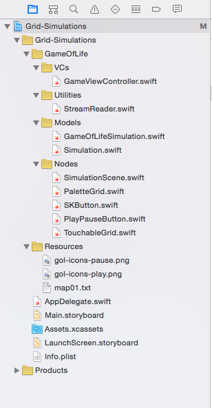
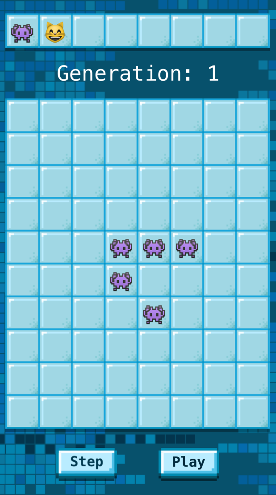

Our first step is to transfer your code from Swift Playgrounds to the Xcode starter project. But to do this, you'll need to understand the hierarchy of different files in the project, and what their roles are. Bring up the starter project, and look at the sidebar on the left. With the folders expanded, it look like this:



Here are each of the folders and their corresponding roles:

- __VCs__: VC stands for View Controller, and is one of the concepts of the _Model-View-Controller programming pattern_ utilized by Apple's user interface code. The View Controller is essentially responsible for transferring data and data changes from the "Model" (the data which we want to represent on the screen), to the "View" (the visual representation of our data). Our project only has one View Controller: `GameViewController`, which sets up the Simulation and a scene to display it. We'll edit this when we want to display scenes other than our default Game of Life simulation.
  - You can learn more about the MVC pattern in [Apple's documentation](https://developer.apple.com/library/mac/documentation/General/Conceptual/DevPedia-CocoaCore/MVC.html).
- __Utilities__: Here we have code that serves supplementary functions for our project. In this case, we have a handy `StreamReader` class that handles the reading of grid data from a .txt file.
- __Models__: The "M" in the _MVC pattern_, the Models essentially contain code for the data we're trying to present, and logic for how that data will change. In this case, the models we have are our Simulations! You will edit code in `GameOfLifeSimulation.swift`, which will house our update logic for Game of Life.
- __Nodes__: These files contain the behind-the-scenes code that represent the UI that you see on the screen – such as the grid, and the play/pause and step buttons. The folder is named "Node" because all of these classes inherit from SKNode – which is the generic Node class provided by Apple's SpriteKit. You won't need to touch these files for the most part.
- __Resources__: These contain the images and text files that are necessary for the project. For example, `01.txt` contains a simple Glider pattern, which you can load into your grid. This is useful for testing if your Game of Life logic is working correctly.
- __AppDelegate.swift__: This file is essentially the "entry point" for your iOS application. On application startup, a function inside `AppDelegate.swift` determines what View Controller to load, so that your simulation code can start running. We won't edit `AppDelegate` in our tutorial, but it's still important to know where the code starts running!

When working with large Xcode projects, it's often important to group code that executes similar functions in groups together. Understanding the relationships between multiple classes, and how it relates to the project hierarchy, will help you jump into existing projects more easily, and make your future projects more organized!

> [action]
> Quickly go through each of the files and folders in the sidebar, and make sure you can take a general guess as to what their roles are in the project overall. Pay special attention to the files that you'll edit, namely `GameOfLifeSimulation.swift`, and `GameViewController.swift`.

# Running the Starter code

Run the project now, by hitting the "Play" triangle on the top left of your project window. If compilation finishes successfully, an iOS simulator window should pop up, and start running a starter simulation: an unmoving Glider, like below.



You should also be able to press the Start/Stop button, and also click on the screen to turn any of the grid cells into Hearts. You can click again to turn the cell back off, or you can click a different character in the palette above, to change the emoji that you want to "paint" on the grid.

> [action]
> Run the starter code as is, and play with the UI. Try clicking the "Step" and "Play" buttons, selecting characters from the palette, and toggling cells on the grid.

To see the code responsible for getting this much on the screen, open up `GameViewController.swift`. As said before, this is a View Controller – responsible for setting up the scene for our simulation. The initialization code is here:

```swift
let filePath = NSBundle.mainBundle().pathForResource("map01", ofType: "txt")!
let sim = GameOfLifeSimulation(file: filePath)!

let palette: [Character?] = ["👾", "😸", nil, nil, nil, nil, nil, nil, nil]

let scene = SimulationScene(fileNamed: "SimulationScene")!
scene.setup(simulation: sim, palette: palette)
```

Here, the View Controller loads up a `GameOfLifeSimulation` using filePath `map01.txt` to fill up its initial grid state, and uses it to setup the `SimulationScene`, using its `sim` and `palette` variables as parameters. In order to see why our Glider isn't moving, let's open up `GameOfLifeSimulation.swift`:

```swift
public override func update() {

}

func getAlive(grid: [[Character?]], column x: Int, row y: Int) -> Int {
    return 1
}

func countNeighbors(grid: [[Character?]], column x: Int, row y: Int) -> Int {
    return 1
}
```

Oh no! All of our functions are empty! To fix this, we'll need to copy over our code we wrote in the previous Playground over to this file, to make our Glider move.

# Transferring Game Of Life logic

First of all, we need to transfer our logic for `countNeighbors` and `getAlive`, the functions we wrote to count the number of alive neighbors for each cell.

> [action]
> Go to Page 6 of our Swift Playgrounds course. Copy over the contents of function `getAlive`, and copy it to the empty `getAlive` function in Xcode, getting rid of the placeholder `return 1` statement. Do the same for function `countNeighbors`.

Great! Now we're ready to copy over the update loop for Game Of Life.

> [action]
> Go to Page 7 of the Swift Playgrounds course. Copy over the contents of function `update` over to the corresponding function in `GameViewController.swift` in the Xcode project.
>
> Now run the project! Click the "Start" triangle at the top left.

Does your Glider move as expected? If not, go back to your Swift playgrounds and make sure your code is correct. When you're done, you can move on to the next step!
